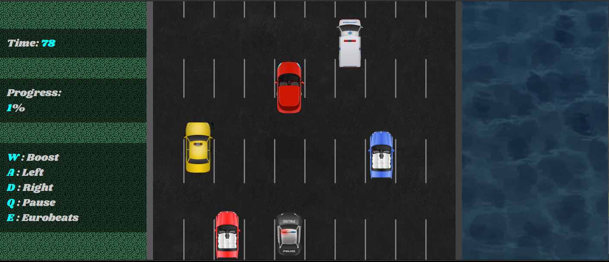
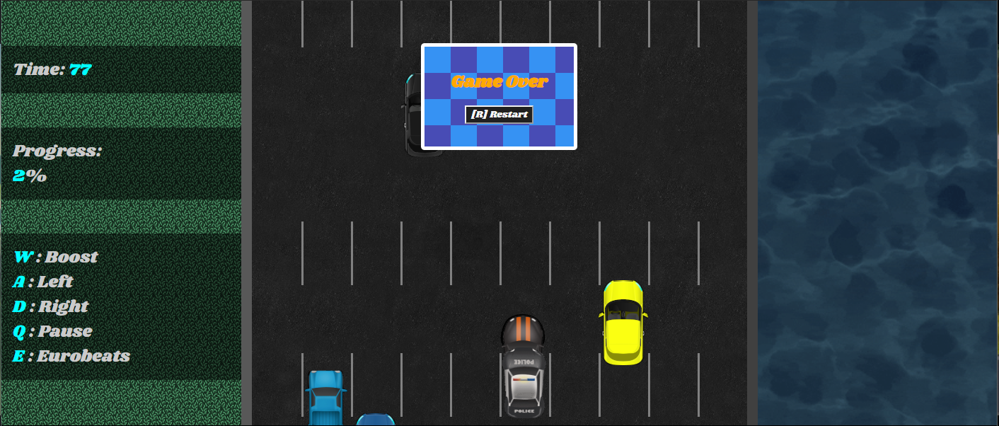
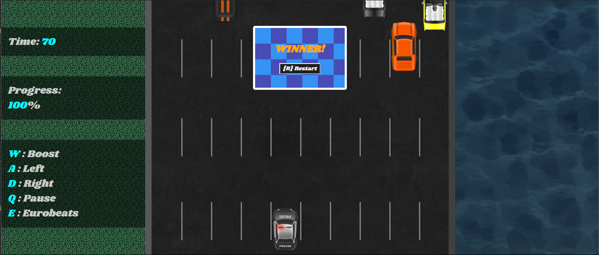

# Object Oriented Programming Game Project
First JavaScript project completed as part of Concordia Bootcamps course. Built in entirely vanilla JS 
## **EnRoute!**
Inspired by early flash games Enroute! was created to be relatively simple, but engaging and slightly addictive!
The games basic premise is that the player controls a police car, racing against both the clock and traffic, to reach the destination and/or emergency.

---
## Screenshots

---
### Features:

- Using A and D to move the car Left and Right respectively, navigate around other cars. Crashing into one will end your game. 

- A boost function is activated via holding the W key, it will double your speed and Progress gains.
Progress increases by 1% per second, however there are less than 100 seconds on the clock! 
You must use your Boost wisely to gain more progress at the increased risk of crashing.

- Attached to the game is an appropriate eurobeat soundtrack. 
This can be toggled on or off via the E key. Default is off and volume is set at a comfortable 50% to avoid speaker blasting.
Also note the crash is accompanied by a custom non-tiresquealing/irritating noise. The police lights flash too. This was merely enabled by creating a gif in a separate program.
Player car is deliberately slightly shorter than other cars, to make play less punishing and be more distinct.
- Non-player car visual appearance is selected randomly from 16 available models.

- On the borders of the game are grass and water. The grass containing the game information, the water just being prettyish(made somewhat opaque to achieve better game palette matching).
Both are responsive to window resizing, allowing game to be played on somewhat smaller window size. 

- On Crash or Win the game can be restarted easily using the R key. Optional button is also provided.
Also the game can be paused at any time with the Q key.
The intention was to keep all controls conveniently close together for one hand.

---
### Some brief Hows:

- The forward movement illusion is made by the constantly 'falling' road lines.
These are set to fall at a consistent rate using the game clock. Line creation however is controlled by it's own interval.

- Pausing was achieved by replacing the game clock with an in-game function, thereby allowing for game freezing and manipulation for other elements.

- Boost was created by adding and removing extra intervals relating to game timing and progress. Reverse engineered from problems encountered when constructing the pause ability.

- Win condition merely track progress related variable.

- Any restart clears all intervals and global variables.

### Troubles:

- Playing with intervals and timing was difficult. If you duplicate an interval, the variable it was assigned to is reassigned to the duplicate, thus becomes unable to be cleared. Took a bit to track this down as a problem was expressed only under certain conditions.

- Early on made attempts to implement lives. Had difficulty as collision mechanics registered multiple 'deads' in a fraction of a second. Decided not a priority after attempting other game mechanics. Would take time to implement if game had more added complexity.

- Had difficulty attempting to animate police car lights using multiple images in an array, not much luck searching methods online, wasn't a priority, but would like to solve.

- Discovered that replacing innerText in a div also removes its appended children.

- Key controls were an issue, before implementing a toggle and disabling repeating.

### With more time!:

- Clean up code. There are obvious and less obvious areas where code could be condensed or combined to be less messy.

- Trees. Really would like to add some subtle trees(possibly randomised) scrolling down on the grass area to further sell the movement illusion. Implement by extending Roadline class, syncing timing.

- Would like to get roadline generation synced to game timing better, is currently standalone.
Shows when pausing at specific moments and when boosting. Not game breaking though.

- Would very much like to add a better winning reward. Intended to stop flow of cars then after a few seconds fade out game area to a small video or gif of police action (possibly randomised from a selection that also includes some comedic anticlimaxes). 

- Also adding a start screen and start button. Additionally a small intro video or gif (skippable). Neither returns on restart, only on page refresh.

- Would like to have player car display as crashed/crumpled/on fire when crashed. Lights continue to blink regardless.

- Vertical movement: Not hard to implement, not sure if will add much to gameplay enjoyment.

- More audio tracks and ability to skip, increase volume etc by keys.

- More subtle sound effects: randomly provided cars honking(quietly) or drivers exclamations.

- Levels: Would need more dynamic things occurring in game. Extra hazards and powerups.
Possibly linking boost ability to rely on fuel pickups.
One hazard would like to add is a fish coming out of the water to either land on a lane and move down or be a horizontally moving hazard.
Also a power up the would let you deploy a jump to go over cars. Scaling player car would have desired visual effect.

Hope you enjoy!
